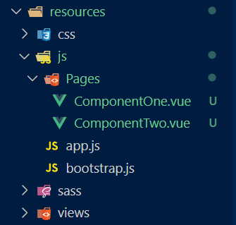

# Repositório para Academia Fênix Power

Wiki está na pasta wiki.

---

## Instalação Vue.js

1. Instalando dependências

```composer require laravel/ui```

2. 

```php artisan ui vue```

3. 
```npm install && npm run dev```

## Instalação Inertia

### Server-side 

1. Instalando dependências

```composer require inertiajs/inertia-laravel```

2. _app.blade.php_

```HTML
<header>
@vite('resources/js/app.js')
@inertiaHead
</header>

<body>
@inertia
</body>
```

3. Configurando middleware Laravel-Vue

```php artisan inertia:middleware```

4. App\Http\Kernel

```PHP
'web' => [
    // ...
    \App\Http\Middleware\HandleInertiaRequests::class,
],
```

### Client-side

1. Instalando dependências

```
npm install @inertiajs/vue3
```

2. resources/js/app.js

```js
import { createApp, h } from 'vue'
import { createInertiaApp } from '@inertiajs/vue3'

createInertiaApp({
  resolve: name => {
    const pages = import.meta.glob('./Pages/**/*.vue', { eager: true })
    return pages[`./Pages/${name}.vue`]
  },
  setup({ el, App, props, plugin }) {
    createApp({ render: () => h(App, props) })
      .use(plugin)
      .mount(el)
  },
})
```

## Estrutura de pastas



diff